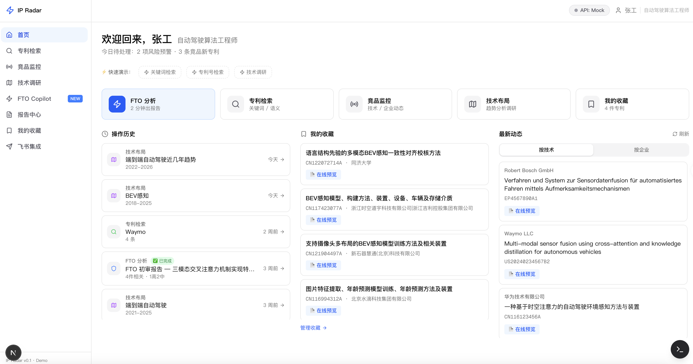
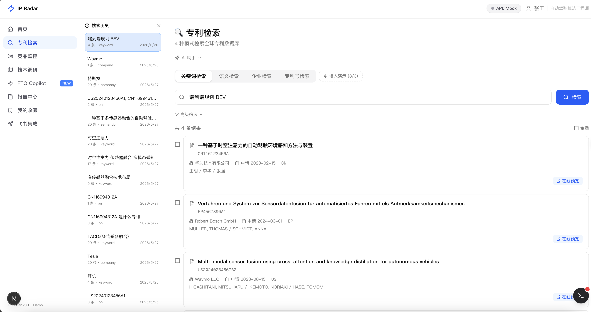
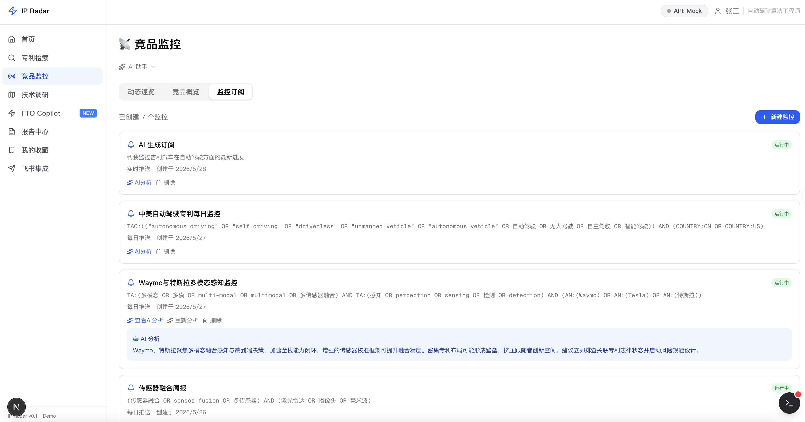
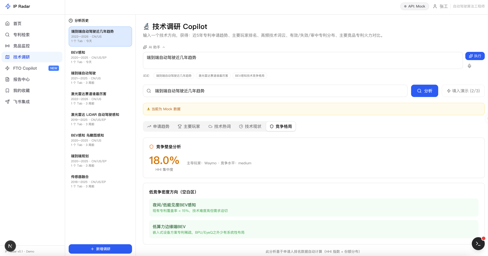
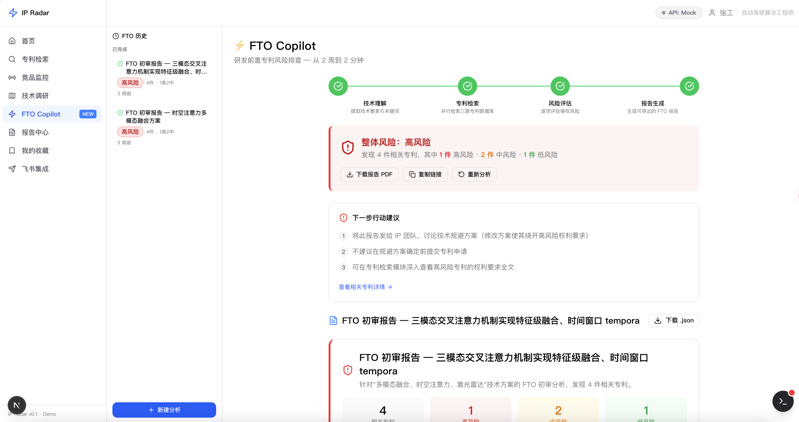
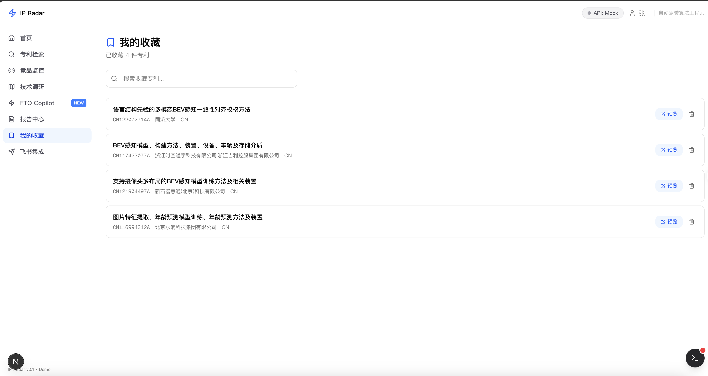
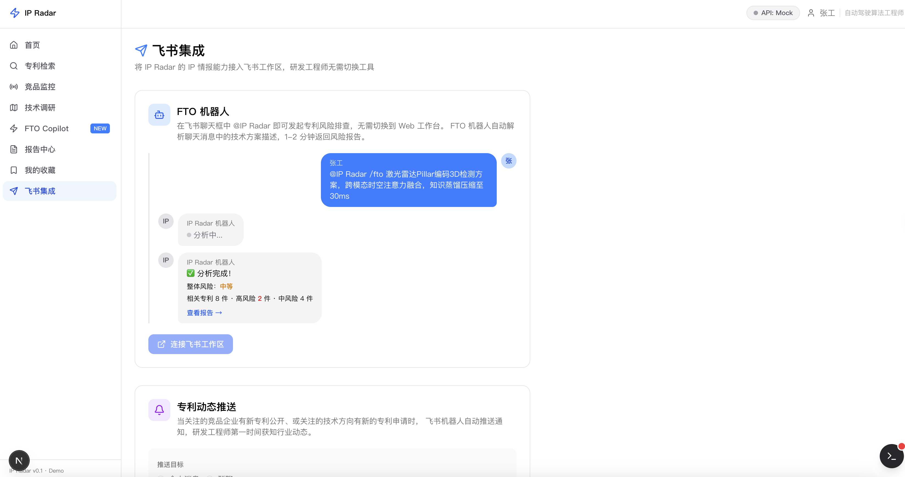

# IP Radar：自动驾驶专利情报分析平台

## 项目概述

IP Radar 是面向算法研发工程师的专利情报 Web 工作台，覆盖研发全流程 4 类核心 IP 场景。

本项目为 FDE 岗位面试场景的 coding 题交付物，相关信息已脱敏处理。

项目对接某专利开放平台 API 获取真实专利数据，同时内置 Mock 模式支持零配置本地演示。

在面试场景的时间约束下（开发周期不足 3 天），项目以最小可用 Demo 的形态交付，但保持了完整的前后端实现与全链路可追溯设计，在专利检索、分析、调研等场景已具备初步可用性。

设计出发点：以业务价值为导向，聚焦算法研发工程师的真实专利情报需求，针对检索、监控、调研、FTO 四类高频场景，确保每一项功能都对应一处可演示、可感知的真实效率提升，以此设计最小业务场景点闭环MVP。

开发工具链：在功能场景与预期效果已明确的前提下，顶层架构设计由 Claude Code + Opus 4.6 + superpowers skill 完成，代码实现由 Reasonix + DeepSeek V4 Pro 完成；整体采用模块化设计，分阶段推进并在实现过程中异步开展边写边测，开发全程累计消耗约 1.6 亿 tokens。

> ⚠️ **免责声明**
>
> - 本项目为个人技术作品展示，**不构成任何商业产品、服务或商业承诺**，按「现状（as-is）」提供，不附带任何明示或默示担保。
> - 本项目与所对接的专利数据平台、DeepSeek、阿里云 DashScope 等第三方服务**无任何隶属、合作或背书关系**，相关名称、商标及数据归各自权利人所有。项目中的接口配置仅为示例，使用者须自行注册并取得各平台的合法授权，并遵守其服务条款。
> - 本项目的 FTO 风险评估、专利摘要及一切分析结果均由程序与大模型自动生成，**仅供技术参考，不构成任何法律意见，亦不构成专利侵权或自由实施（FTO）的最终结论**。正式的 FTO 判断须由具备资质的专利代理师或律师完成。
> - 因使用本项目（含在 Live 模式下调用第三方 API、以及依据其输出所做的任何决策）而产生的任何风险、费用、损失或法律责任，均由使用者自行承担。
>
> 完整免责声明另见 [DISCLAIMER.md](DISCLAIMER.md)。

核心功能场景：

| 场景 | 使用者与触发时机 | 使用方式 | 提升效果 |
| --- | --- | --- | --- |
| **检索技术参考** | 算法工程师在方案设计或立项调研阶段，需要查找某项技术的已有专利 | 提供手动与 AI 助手两种方式：<br>• 手动选择关键词、语义、企业、专利号四种检索模式，并按受理局、IPC、年份、法律状态筛选<br>• 以自然语言描述需求，由内置 AI 助手自动选定检索模式、填入参数并触发执行 | 快速定位可借鉴的技术实现与现有方案，减少重复研发 |
| **跟踪竞品动态** | 工程师或技术负责人需要持续关注头部竞品的专利布局 | 提供手动与 AI 助手两种配置方式：<br>• 手动设定检索式、推送频率与过滤条件<br>• 以自然语言描述需求，由 AI 助手生成订阅配置<br>订阅创建后，系统按设定频率自动检索新增专利、生成 AI 风险摘要并站内推送 | 无需人工反复检索即可及时掌握竞品动向，尽早识别潜在风险与技术机会 |
| **调研技术现状** | 在技术选型或立项评估时，需要把握某一技术领域的整体格局 | 提供手动与 AI 助手两种输入方式：<br>• 手动填写技术主题词与年份、受理局范围<br>• 以自然语言描述需求，由 AI 助手解析为分析参数<br>系统据此自动生成趋势、申请人、热词、法律状态、竞争格局五维分析 | 快速建立对该领域的整体认知，识别技术空白区与热点，支撑技术决策 |
| **排查侵权风险** | 在方案落地或产品上线前，需要初步评估自由实施（FTO）风险 | 上传技术方案文本与架构图，由 FTO Copilot 经技术理解、检索、风险评估、报告生成四步自助初筛，其中技术要素等关键步骤支持人工确认与编辑 | 在正式法务介入前完成快速自评，全流程可追溯，提高与专业人员的沟通效率 |
  

## 功能详细说明

| 一级功能 | 二级功能 | 说明 |
| --- | --- | --- |
| **首页** | 操作历史聚合 | FTO / 专利检索 / 技术调研历史分栏展示，可直接跳转复用 |
| | 竞品动态 Feed | 按关注技术标签过滤最新专利，显示风险等级，支持全文预览 |
| | 收藏夹入口 | 汇总跨页面收藏专利，支持详情与 PDF 预览 |
| **专利检索** | 关键词检索 | 基于专利检索语法结构化查询，适配定向检索 |
| | 语义检索 | 输入技术描述，向量相似度匹配，适配早期探索 |
| | 企业检索 | 查询指定企业全球专利列表，用于竞品全量分析 |
| | 专利号检索 | 批量精确匹配专利号，适配线索核查 |
| | 高级筛选 | 受理局、IPC、年份、法律状态多维过滤 |
| | 检索历史 | 侧边栏记录检索记录，支持删除、复用 |
| | 专利详情预览 | 弹窗展示 PDF、AI 摘要、一键收藏 |
| | AI 助手 | 自然语言输入需求，自动选检索模式、填参数、执行 |
| **竞品监控** | 动态速览 | 实时展示头部竞品最新专利，含风险等级 |
| | 竞品概览 | 申请量趋势、技术标签、代表专利卡片 |
| | 手动创建订阅 | 自定义检索式、推送频率、过滤条件 |
| | AI 辅助创建订阅 | 自然语言生成检索式与配置，一键创建 |
| | 订阅管理 | 激活 / 暂停 / 删除订阅，显示未读角标 |
| | AI 风险分析 | 自动生成新增专利风险摘要，本地缓存避免重复调用 |
| | AI 助手 | 对话式配置监控，无需掌握检索语法 |
| **技术调研 Copilot** | 申请趋势 | 2018–2025 专利申请量折线图，呈现热度周期 |
| | 主要申请人 | TOP 申请人条形图，呈现竞争格局 |
| | 技术热词 | 高频关键词词云，定位活跃技术分支 |
| | 技术现状 | 专利法律状态分布 + TOP5 核心专利 |
| | 竞争格局 | 矩阵图展示各申请人技术布局密度，识别技术空白区与高竞争密度区 |
| | 调研历史 | 侧边栏记录任务参数，支持复用 |
| | AI 助手 | 自然语言解析调研需求，自动执行五维分析 |
| **FTO Copilot** | 多模态输入 | 支持文本 + 架构图上传，图文联合理解 |
| | Step1 技术理解 | 提取核心功能、实现手段、IPC、检索关键词 |
| | HITL 人机确认 | 人工编辑技术要素，实时同步检索参数 |
| | Step2 专利检索 | 三路并行检索 + AI 去重排序，输出 Top10–20 候选专利 |
| | Step3 风险评估 | 逐条匹配权利要求，输出风险等级 + 规避建议 |
| | Step4 报告生成 | 结构化 FTO 初审报告，自动归档至报告中心 |
| | 全流程可追溯 | 每步可查 LLM Prompt、API 日志、Token 用量 |
| | 历史侧边栏 | 查看历史 FTO 任务与报告 |
| | 会话持久化 | 切页恢复任意阶段状态 |
| **报告中心** | 报告列表 | 按时间展示历史 FTO 报告，含风险等级标签 |
| | 报告详情 | 结构化渲染报告，支持专利全文预览 |
| **全局功能** | Mock ⇄ Live 切换 | 一键切换数据源，Live 模式需配置 API Key |
| | 专利全文预览弹窗 | 全平台统一预览入口，含 PDF、AI 摘要、收藏 |
| | 收藏夹 | 跨页面持久化收藏，本地存储 |
| | 活动日志悬浮窗 | 实时展示 API、LLM、系统事件日志，支持查看完整 JSON |

## AI Agent 架构

项目内置 AI 助手，在专利检索、竞品监控、技术调研三个页面均支持自然语言交互。用户只需用一句话描述需求，Agent 即可自动完成模式选择、参数填充与触发执行，无需手动操作任何控件。

整体设计遵循一条核心原则：**UI 与 Agent 编排层不感知数据源，Tool 仅封装单次 API 调用**。能力分为两层——Tool（原子能力）与 Skill（领域编排），Skill 在执行时通过内置的意图路由机制选定 Tool 并生成参数；此外在三页面助手之外另设一个专门处理长流程任务的 FTO 编排 Agent。基于此分层，新增一个 AI 入口仅需组合已有 Tool 并编写一段 system prompt，无需改动底层 API 或 UI。

### Tool 层：原子能力单元

共 10 个 Tool，全部遵循 MCP 兼容格式（`name` + `displayName` + `description` + `inputSchema`(zod) + `execute`），由 `registry.ts` 统一注册：

| 分类 | Tool |
| --- | --- |
| 检索 | 关键词检索、语义检索、企业检索、专利号查证 |
| 详情 | 详情获取、权利要求、PDF 下载、法律状态 |
| 分析 | 趋势分析、申请人分析 |

每个 Tool 仅封装一次外部 API 调用，不感知业务上下文，亦不持有跨调用状态，因此可被任意 Skill 组合复用。

### Skill 层：领域编排

每个 Skill 选取一个 Tool 子集，注入领域专用的 system prompt，让 LLM 在受限的工具范围内做决策，并把结果映射成前端可直接消费的 `{ tab, params, autoSubmit }`。当前 3 个 Skill：

| Skill | 绑定的 Tools | 路由模式 | 作用示例 |
| --- | --- | --- | --- |
| `smart_patent_search` | 关键词 / 语义 / 企业 / 专利号检索（4） | 工具选择 | "找近三年特斯拉激光雷达专利" → 自动选企业检索、填入 Tesla + lidar |
| `tech_research_planner` | 趋势分析 / 申请人分析 / 关键词检索（3） | 参数抽取 | "调研 BEV 感知 2019–2024 中美专利" → 解析出主题词、年份区间、受理局 |
| `monitor_configurator` | 关键词检索 / 企业检索（2） | 参数抽取 | "帮我监控小鹏的端到端规划专利" → 生成含同义词扩展的检索式与订阅配置 |

### Skill 的意图路由机制

Skill 执行时由 `ToolRouter` 将其 system prompt 与用户输入拼接后调用 DeepSeek，推理出目标 Tool 与结构化参数。需要说明的是，项目对接的 DeepSeek 走 Anthropic 兼容协议，**不原生支持 function calling**，因此工具选择由 **prompt 工程**实现：在 prompt 中列出可用工具，并约定 LLM 返回 `{ "tool", "params" }` 形式的 JSON，再由 Router 完成 markdown 代码块剥离、平衡括号提取与截断容错解析。两种工作模式如下：

- **`route()`（工具选择）**：在 prompt 中暴露多个候选 Tool，让 LLM 自主选一个并给出参数，用于 `smart_patent_search`。
- **`extractParams()`（参数抽取）**：目标已固定，让 LLM 直接返回表单参数 JSON，用于 `tech_research_planner` 与 `monitor_configurator`。

Router 解析出的 Tool 入参，在执行前统一经 `zod` schema 校验（`executor.ts`），非法参数直接拦截；对 LLM 输出本身的 `zod.safeParse` 结构化校验与失败重试，则集中在下文的 FTO Copilot 链路。

### FTO Copilot：多步编排 Agent

FTO Copilot 是独立于上述三页面助手的多步编排 Agent，**不经过 Router**，而是将侵权风险初筛拆解为一条 4 步流水线（[`pipeline.ts`](src/lib/agent/pipeline.ts)），以 `AsyncGenerator` 逐步 `yield` `StepUpdate`，经 SSE 流式推送进度：

```
Step1 技术理解 ──→ Step2 专利检索 ──→ Step3 风险评估 ──→ Step4 报告生成
   ↑ HITL 确认                             ↓ 逐条匹配权利要求
   人工可编辑技术要素                       输出 high/medium/low + 规避建议
```

- **Step1 技术理解**：从文本（+ 可选架构图，经 Qwen-VL 转文本）提取核心功能、实现手段、IPC、检索关键词。
- **HITL 人机确认**：Step1 完成后暂停，等待用户编辑确认技术要素；确认版本回填后跳过 LLM 重新提取，并实时同步到 Step2 的检索参数。
- **Step2 专利检索**：三路并行检索（关键词 + 语义 + 竞品企业）+ DeepSeek 智能去重融合排序，输出候选专利。
- **Step3 风险评估**：对候选专利逐条匹配权利要求，输出 high / medium / low 风险等级与规避建议。
- **Step4 报告生成**：产出结构化 FTO 初审报告并归档至报告中心。

整个流程复用 Tool / Provider 层，并支持会话持久化（`SessionStore`）：切页或刷新后可回到上次离开的步骤，且每一步均可展开查看 LLM Prompt、API 请求/响应与 Token 用量，实现全链路可追溯。

> 说明：本项目为面试场景交付物，开发周期有限（不足 3 天），上述 Agent 体系的内部 harness（工具调度、重试与降级、状态管理等）设计仍有诸多未尽完善之处，实现以可演示、可跑通、对应场景下具备真实效率提升为先。设计与代码若有粗糙之处，敬请见谅并欢迎指正。

## 界面预览

| 首页工作台 | 专利检索 | 竞品监控 |
| --- | --- | --- |
|  |  |  |

| 技术调研 | FTO Copilot | 收藏夹 |
| --- | --- | --- |
|  |  |  |

| 飞书消息推送 |
| --- |
|  |

## 快速开始

### 环境要求

- Node.js ≥ 18（推荐 20.x LTS）
- npm ≥ 9

### 部署步骤

```bash
# 1. 克隆仓库
git clone https://github.com/woddjkjk-ship-it/ip-radar.git
cd ip-radar

# 2. 安装依赖
npm install

# 3. 配置环境变量
cp .env.local.example .env.local

# 4. 构建生产包
npm run build

# 5. 启动服务
npm start
```

打开浏览器访问 [http://localhost:3000](http://localhost:3000)。

### 模式配置

**Mock 模式（演示）**：保持 `DATA_MODE=mock`，其余 Key 留空即可。Mock 模式只读取本地 fixture，不需要外部 API Key，克隆后可直接构建和演示。

**Live 模式（生产）**：编辑 `.env.local`，填入真实 API Key：

```env
PATSNAP_API_KEY=xxx
DEEPSEEK_API_KEY=xxx
DASHSCOPE_API_KEY=xxx
```

## 本地开发

```bash
npm run dev
```

开发服务默认运行在 [http://localhost:3000](http://localhost:3000)。

## 环境变量

复制 `.env.local.example` 为 `.env.local` 后按需填写：

| 变量 | 必填 | 说明 |
| --- | --- | --- |
| `DATA_MODE` | 是 | `mock` 使用本地数据，`live` 调用真实服务 |
| `PATSNAP_API_KEY` | Live 模式必填 | 专利开放平台 API Key |
| `PATSNAP_API_BASE` | 否 | 默认 `https://connect.zhihuiya.com` |
| `DEEPSEEK_API_KEY` | AI 功能必填 | DeepSeek API Key |
| `DEEPSEEK_API_BASE` | 否 | 默认使用示例文件中的地址 |
| `DEEPSEEK_MODEL` | 否 | 默认使用示例文件中的模型名 |
| `DASHSCOPE_API_KEY` | 图像理解必填 | DashScope 兼容接口 API Key |
| `DASHSCOPE_API_BASE` | 否 | 默认使用示例文件中的地址 |
| `QWEN_VL_MODEL` | 否 | 默认使用示例文件中的模型名 |

- 不填写 API Key 时，项目仍可在 Mock 模式下构建和浏览。
- 切换到 Live 模式后，专利数据接口会读取 `PATSNAP_API_KEY`。
- AI 助手、FTO 风险评估和摘要生成依赖 `DEEPSEEK_API_KEY`；缺失时相关功能会使用 Mock 或降级结果。
- 上传架构图并做图像理解时需要 `DASHSCOPE_API_KEY`。

## Docker

```bash
docker build -t ip-radar .
docker run --rm -p 3000:3000 --env-file .env.local ip-radar
```

如果只想跑 Mock 模式，`.env.local` 可以直接由 `.env.local.example` 复制得到。

## 技术架构

### 架构分层

```
前端页面层（Next.js 16）
    ↓ HTTP / SSE
API 路由层（Next.js API Routes）
    ↓ 调用
核心服务层（Tool + Skill + LLM）
    ↓ 数据读取
数据层（Mock / 专利数据 API / 本地存储）
```

### 技术栈说明

| 技术 | 作用 |
| --- | --- |
| Next.js 16 App Router | 前后端一体框架，统一页面与 API 路由 |
| TypeScript + Zod | 全链路类型安全，校验 API 与 LLM 输出 |
| Tailwind CSS + shadcn/ui | 构建 UI 组件，高效样式开发 |
| DeepSeek V4 Pro | 核心推理：意图解析、工具路由、风险评估、报告生成 |
| Qwen-VL-Max | 多模态能力：架构图转结构化文本 |
| 专利数据 API | 真实专利数据来源（检索、摘要、权利要求、法律状态等） |
| Tool + Skill 双层架构 | Tool 封装 API，Skill 组合 Tool，适配 AI 交互 |
| SSE | FTO 流水线流式推送，实时展示进度 |
| PatentDataProvider | 统一数据接口，隔离 Mock / Live 数据源 |
| localStorage / sessionStorage | 收藏、历史、会话状态本地持久化 |

## 项目结构

```text
src/
  app/                    Next.js 页面和 API routes
  components/             页面组件、业务组件和 shadcn/ui 组件
  fixtures/               Mock 数据
  lib/
    agent/                FTO Copilot 流水线
    llm/                  LLM 客户端和路由
    providers/            Mock / Live 数据源抽象
    session/              会话与步骤追踪
    tools/                Tool 定义、执行器和 Skill 编排
    types/                共享类型与 zod schema
docs/
  DESIGN.md               公开架构说明
test/
  *.ts, *.mjs             本地验证脚本
```

## 安全说明

- 不要提交 `.env.local` 或任何真实 API Key。
- 活动日志和测试报告可能包含 prompt、response、请求参数或专利数据，公开分享前需要二次脱敏。
- 默认仓库只应包含 Mock 数据、示例配置和公开文档。

## License

MIT
